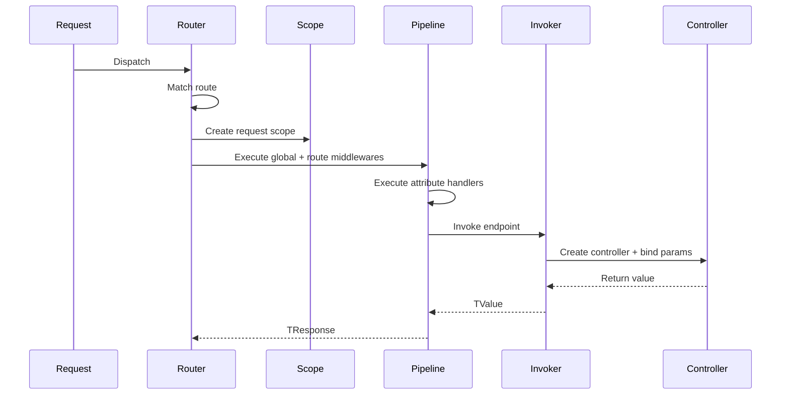

# Architecture Overview

BackendFramework is organized so framework code lives outside `Src`, while `Src` is reserved for application code, examples, experiments, or tests.

## Main areas

```text
Shared/       Shared framework infrastructure
Http/         HTTP server, routing, context, parameters, middlewares
Dto/          DTO contracts, binding and validation
Src/          Application/test code only
Docs/         Documentation
Config/       Default runtime configuration files
```

## Framework responsibilities

The framework provides:

- a dependency container with singleton, scoped, transient and factory registrations;
- request scopes;
- constructor injection;
- attribute-based controllers and routes;
- parameter binding;
- DTO parsing and validation;
- response mapping;
- middleware pipeline support;
- custom endpoint attribute handlers;
- typed options through `IOptions<T>`;
- a default logger implementation.

## Application responsibilities

Application code is expected to define:

- concrete controllers;
- application services and ports;
- DTOs;
- additional options records;
- custom middlewares;
- custom endpoint attributes and handlers;
- dependency registrations.

## Request lifecycle



## Important separation

Dependency registrations are not the same as HTTP framework component registrations.

Dependencies are registered by contract/port:

```pascal
Container.AddScoped<IAuthService, TAuthService>;
```

HTTP framework components are registered by class:

```pascal
Container.AddController(TUsersController);
Container.Use(TLoggingMiddleware);
Container.AddAttributeHandler(TRequireRoleHandler);
```

Controllers, middlewares and endpoint attribute handlers are created by the framework using constructor injection, but they are not registered as DI dependencies themselves.
