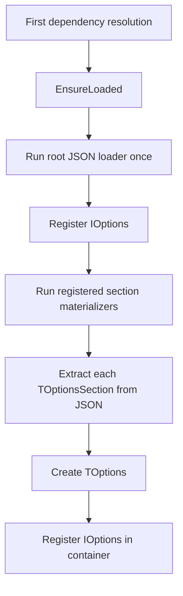

# Options and Configuration

The framework exposes typed configuration through `IOptions<T>` and `TOptions<T>`.

Core unit:

```text
Source/Core/Options.Port.pas
```

Registration/runtime unit:

```text
Source/Core/Options.Registry.pas
```

## Core types

Options are declared as classes that inherit from `TOptionsSection`.

```pascal
type
  TOptionsSection = class abstract
  protected
    function GetSectionName: string; virtual; abstract;
  public
    property SectionName: string read GetSectionName;
  end;

  IOptions<T: class> = interface
    function GetValue: T;
    property Value: T read GetValue;
  end;

  TOptions<T: class> = class(TInterfacedObject, IOptions<T>)
  end;
```

`TOptionsSection` defines the JSON section name. `IOptions<T>` is the dependency injected into services.

## Declaring an options class

Create a class that inherits from `TOptionsSection` and override `GetSectionName`.

Example:

```pascal
unit Logger.Options;

interface

uses
  Options.Port;

type
  TLoggerOptions = class(TOptionsSection)
  private
    FLogLevel: string;
    FFilePath: string;

    function GetSectionName: string; override;
  public
    property LogLevel: string read FLogLevel write FLogLevel;
    property FilePath: string read FFilePath write FFilePath;
  end;

implementation

function TLoggerOptions.GetSectionName: string;
begin
  Result := 'Logger';
end;

end.
```

Given this class, the configuration file must contain a `Logger` object:

```json
{
  "Logger": {
    "LogLevel": "INFO",
    "FilePath": "./Logs/app.log"
  }
}
```

The JSON property names are mapped to writable public/published properties in the options class.

## Consuming options

Dependencies consume options through `IOptions<TSpecificOptions>`.

```pascal
type
  TLogger = class(TInterfacedObject, ILogger)
  private
    FOptions: TLoggerOptions;
  public
    constructor Create(const AOptions: IOptions<TLoggerOptions>);
  end;

constructor TLogger.Create(const AOptions: IOptions<TLoggerOptions>);
begin
  inherited Create;
  FOptions := AOptions.Value;
end;
```

`AOptions.Value` returns the typed options object, for example `TLoggerOptions`.

## Root options

The framework uses a JSON root object.

Unit:

```text
Source/Core/App.Options.pas
```

Current type:

```pascal
type
  TAppOptions = TJSONObject;
```

The root JSON contains one object per registered section:

```json
{
  "HttpServer": {
    "Port": 8080
  },
  "Logger": {
    "LogLevel": "INFO",
    "FilePath": "./Logs/app.log"
  }
}
```

## Loader

The default loader is configured by `TAppContainer`.

Unit:

```text
Source/Core/App.Options.Loader.pas
```

The default loader is:

```pascal
TAppOptionsLoader.Execute
```

It loads a JSON object from the default configuration file, optionally merging an override file from `APP_OPTIONS_FILE_PATH`.

The container calls the loader through `TOptionsRegistry.EnsureLoaded` and loads options only once.

## Registering sections

Use `AddOptions<TOptions>` to expose a section as `IOptions<TOptions>`.

```pascal
Container.AddOptions<TLoggerOptions>;
Container.AddOptions<TDatabaseOptions>;
```

`TOptions` must inherit from `TOptionsSection` and implement `GetSectionName`.

```pascal
type
  TDatabaseOptions = class(TOptionsSection)
  private
    FConnectionString: string;

    function GetSectionName: string; override;
  public
    property ConnectionString: string read FConnectionString write FConnectionString;
  end;

function TDatabaseOptions.GetSectionName: string;
begin
  Result := 'Database';
end;
```

This registration exposes:

```pascal
IOptions<TDatabaseOptions>
```

and expects the root JSON to contain:

```json
{
  "Database": {
    "ConnectionString": "..."
  }
}
```

## Default options

`TAppContainer` registers HTTP server options by default:

```pascal
AddOptions<THttpServerOptions>;
```

Applications can register their own sections during bootstrap:

```pascal
App.AddOptions<TLoggerOptions>;
```

## Loading and registration behavior

Options are loaded automatically when the container first needs registered dependencies or descriptors.

The flow is:



## Important implementation detail

`IOptions<T>` instances are registered with an exact `TValue` for the closed generic interface, for example:

```pascal
IOptions<TLoggerOptions>
```

This avoids reconstructing generic interfaces dynamically during constructor invocation and keeps `AOptions.Value` safe when injected through RTTI.

## Notes

- Options sections are classes, not records.
- Every options section must inherit from `TOptionsSection`.
- `GetSectionName` determines the JSON object name in the root configuration.
- The root options value is a `TJSONObject`.
- Dependencies should consume `IOptions<TSpecificOptions>` instead of `TSpecificOptions` directly.
- `TOptions<T>` owns the contained options object and frees it when the options wrapper is destroyed.
