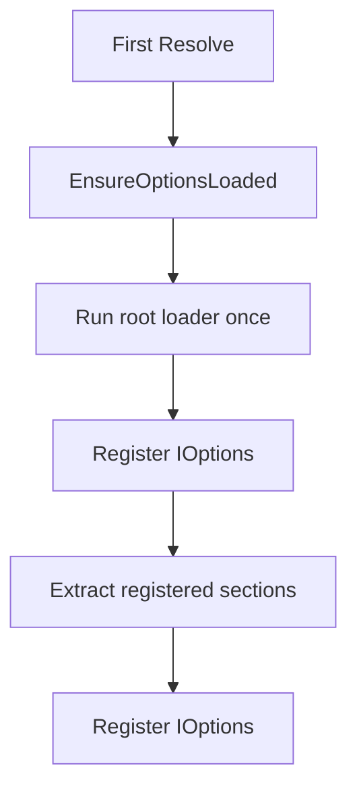

# Options and Configuration

The framework exposes typed configuration through `IOptions<T>` and `TOptions<T>`.

Unit:

```text
Shared/Options/Options.Port.pas
```

## Core types

```pascal
IOptions<T> = interface
  function GetValue: T;
  property Value: T read GetValue;
end;

TOptions<T> = class(TInterfacedObject, IOptions<T>)
end;
```

A dependency can ask for a specific options record directly:

```pascal
constructor TJwtService.Create(const AOptions: IOptions<TJwtOptions>);
begin
  FOptions := AOptions.Value;
end;
```

## Root options

The framework expects a root record named `TAppOptions`.

Unit:

```text
Shared/Options/App.Options.pas
```

Default shape:

```pascal
type
  TAppOptions = record
    Logger: TLoggerOptions;
  end;
```

Additional configuration sections should be added as fields:

```pascal
type
  TAppOptions = record
    Logger: TLoggerOptions;
    Jwt: TJwtOptions;
    Database: TDatabaseOptions;
  end;
```

## Loader

The default loader is configured by `TAppContainer`.

Unit:

```text
Shared/Options/App.Options.Loader.pas
```

Default loader:

```pascal
TAppOptionsLoader.LoadFromDefaultPath
```

The loader returns a fully populated `TAppOptions` record. The container executes it lazily and only once.

## Registering sections

Use `AddOptions<TOptions>('FieldName')` to expose a section as `IOptions<TOptions>`.

```pascal
Container.AddOptions<TJwtOptions>('Jwt');
Container.AddOptions<TDatabaseOptions>('Database');
```

The field name must exist in `TAppOptions` and its type must match `TOptions`.

```pascal
TAppOptions = record
  Jwt: TJwtOptions;
end;
```

This registers:

```pascal
IOptions<TJwtOptions>
```

## Default logger options

`TAppContainer` registers this by default:

```pascal
AddOptions<TLoggerOptions>('Logger');
```

So the root options record must include:

```pascal
Logger: TLoggerOptions;
```

## Loading behavior

Options are loaded automatically when the container first resolves a dependency or descriptor.

The flow is:



## Notes

- Options must be records.
- The root loader returns one record that may contain nested records.
- The container does not parse JSON directly.
- JSON parsing belongs to `TAppOptionsLoader`.
- Dependencies consume `IOptions<TSpecificOptions>`.
