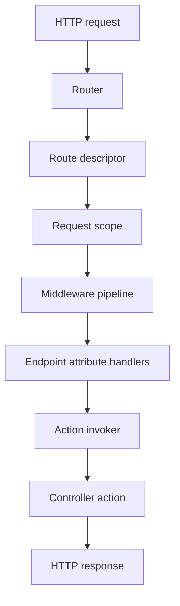

# BackendFramework Documentation

BackendFramework is a Delphi HTTP backend framework built around explicit dependency registration, attribute-based routing, DTO binding/validation, middleware pipelines, and typed application options.

## Documentation sections

1. [Architecture overview](./01-architecture-overview.md)
2. [Dependency container](./02-dependency-container.md)
3. [Options and configuration](./03-options-and-configuration.md)
4. [Logging](./04-logging.md)
5. [Controllers and routing](./05-controllers-and-routing.md)
6. [DTOs and validation](./06-dtos-and-validation.md)
7. [Parameter binding](./07-parameter-binding.md)
8. [Middlewares](./08-middlewares.md)
9. [Custom attributes](./09-custom-attributes.md)
10. [HTTP responses](./10-http-responses.md)
11. [JSON configuration](./11-json-configuration.md)
12. [Project conventions](./12-project-conventions.md)

## High-level request flow

