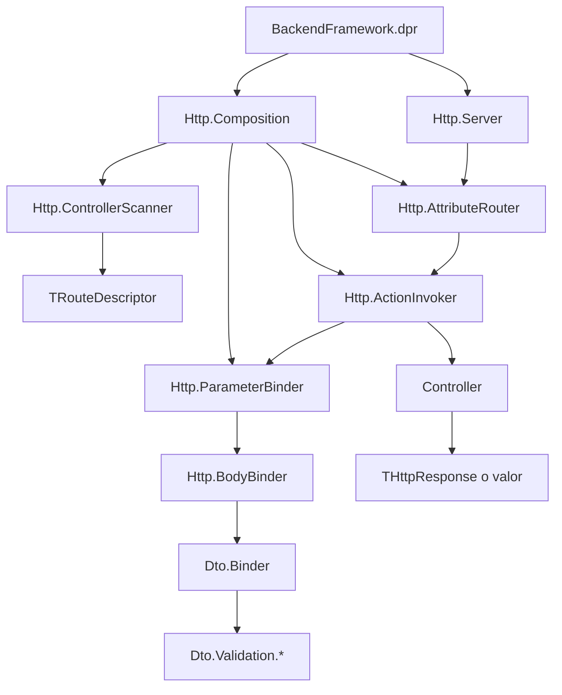

# Análisis completo del proyecto `BackendFramework`

## 1. Resumen ejecutivo

Este proyecto es un **framework backend HTTP para Delphi** orientado a construir APIs de forma declarativa mediante:

- controladores,
- atributos para rutas,
- binding automático de parámetros,
- binding y validación de DTOs JSON,
- composición de un servidor HTTP.

Su intención está documentada en `docs/PROJECT_PLAN.md`, donde se define que el framework debe servir como base para exponer endpoints HTTP usando una arquitectura ordenada, extensible y testeable.

## 2. Naturaleza del proyecto

### Tipo de aplicación

El proyecto principal es:

- `BackendFramework.dpr`

Y está configurado como una **aplicación Console**.

### Objetivo arquitectónico

Según `docs/PROJECT_PLAN.md`, el framework busca:

- exponer métodos de controladores como endpoints HTTP,
- usar attributes como `[Route]`, `[Get]`, `[FromBody]`, etc.,
- desacoplar componentes mediante contratos/interfaces,
- soportar binding y validación de DTOs,
- construir un backend pragmático, extensible y reusable.

---

## 3. Estructura del repositorio

## Carpetas principales

### `Shared`
Contiene infraestructura transversal:

- contratos base,
- excepciones,
- helpers RTTI.

### `Dto`
Contiene todo lo relacionado con:

- atributos de validación y metadata,
- binding desde JSON,
- validación por tipo,
- soporte a DTOs anidados y arrays.

### `Http`
Contiene todo lo relacionado con:

- request/response,
- contexto HTTP,
- atributos de routing,
- descriptors y metadata,
- invocación de acciones,
- binding de parámetros,
- servidor Indy,
- composition root.

### `docs`
Contiene documentación del proyecto.

---

## 4. Punto de entrada real del proyecto

El punto de entrada es:

- `BackendFramework.dpr`

### Qué hace hoy

Actualmente el `dpr`:

- declara todas las unidades del proyecto en el `uses`,
- entra en un `try/except`,
- no crea servidor,
- no registra rutas,
- no escanea controladores,
- no instancia composición,
- no arranca ninguna lógica del framework.

### Flujo real actual

```text
BackendFramework.dpr
  -> carga unidades
  -> entra al begin/end
  -> no hace nada
  -> termina
```

### Conclusión importante

Hay que distinguir entre:

1. **Unidad incluida formalmente en el proyecto**
2. **Unidad realmente activada en runtime**

En este proyecto:

- **todas las unidades `.pas` están incluidas formalmente**, pero
- **la lógica del framework no se activa realmente en runtime**, porque el `dpr` no hace bootstrap.

---

## 5. Flujo teórico de la aplicación

Si el proyecto estuviera cableado como plantea su arquitectura, el flujo esperado sería el siguiente:



## Flujo funcional esperado

1. `THttpServer` recibe un request HTTP.
2. Construye un `THttpRequest`.
3. El router (`TAttributeRouter`) busca una ruta compatible.
4. Si la encuentra:
   - arma un `THttpContext`,
   - invoca `TControllerActionInvoker`.
5. El invoker:
   - resuelve el controller mediante `IContainer`,
   - bindea argumentos con `TParameterBinder`.
6. Si un parámetro es `[FromBody]`:
   - entra `TBodyBinder`,
   - usa `TDtoBinder`,
   - y se aplican las validaciones DTO.
7. Se invoca el método del controller.
8. El resultado se devuelve como respuesta HTTP.

---

## 6. Estructura lógica del framework

El proyecto está dividido conceptualmente en estas capas:

### 6.1 Infraestructura compartida
- contratos comunes,
- excepciones de aplicación,
- helpers RTTI.

### 6.2 Capa DTO
- metadata de propiedades,
- binding desde JSON,
- validación de campos,
- inspección de tipos.

### 6.3 Capa HTTP base
- request,
- response,
- contexto.

### 6.4 Capa de routing
- attributes HTTP,
- escaneo de controllers,
- descriptors de ruta,
- router por atributos.

### 6.5 Capa de binding de parámetros
- metadata de parámetros,
- atributos de fuente,
- conversión de strings,
- binding desde body/query/header/route/context.

### 6.6 Bootstrap
- composición del router,
- creación del servidor HTTP.

---

## 7. Objetivo de cada unidad

## 7.1 Shared

### `Shared/Container/Container.Contract.pas`
**Objetivo:** definir el contrato `IContainer` para resolver dependencias por RTTI.

**Responsabilidad principal:**
- resolver instancias a partir de `PTypeInfo`.

**Uso esperado:**
- resolución de controllers u otros servicios del framework.

---

### `Shared/Exceptions/AppExceptions.pas`
**Objetivo:** centralizar excepciones base del framework no específicamente HTTP.

**Tipos principales:**
- `EAppException`
- `EDependencyException`
- `EServiceException`
- `EMetadataException`
- `EBinderException`
- excepciones derivadas de metadata y dependencias.

**Uso real:**
- la usan varias piezas del binding y composición.

---

### `Shared/Exceptions/HttpExceptions.pas`
**Objetivo:** definir excepciones HTTP tipadas y una utilidad para serializar errores a JSON.

**Tipos principales:**
- `EHttpException`
- `EBadRequestException`
- `EUnauthorizedException`
- `EForbiddenException`
- `ENotFoundException`
- `EConflictException`
- `EInternalServerErrorException`
- `EBadGatewayException`
- `EServiceUnavailableException`

**Extra:**
- `BuildHttpExceptionJson(...)`

**Estado actual:**
- está incluida en el proyecto,
- pero no aparece integrada de forma efectiva en el flujo runtime actual.

---

### `Shared/Rtti/RttiAttribute.Helpers.pas`
**Objetivo:** proveer utilidades genéricas para leer attributes vía RTTI.

**Funciones principales:**
- `HasAttribute<T>`
- `TryGetAttribute<T>`
- `GetAttributes<T>`

**Uso real:**
- validadores DTO,
- inspector de tipos,
- lectura de metadata.

---

## 7.2 DTO

### `Dto/Attributes/Dto.Attributes.pas`
**Objetivo:** declarar los attributes usados en DTOs para metadata y validación.

**Attributes incluidos:**
- `JsonNameAttribute`
- `RequiredAttribute`
- `IsDateAttribute`
- `IsDateTimeAttribute`
- `IsNumberStringAttribute`
- `LengthAttribute`
- `MinAttribute`
- `MaxAttribute`
- `MinItemsAttribute`
- `MaxItemsAttribute`
- `IsInAttribute`

**Rol:**
- describen cómo debe interpretarse y validarse cada propiedad DTO.

---

### `Dto/Binding/Dto.Binder.Contract.pas`
**Objetivo:** declarar la interfaz `IDtoBinder`.

**Responsabilidad:**
- parsear el body crudo JSON y convertirlo en un objeto DTO.

---

### `Dto/Binding/Dto.Binder.pas`
**Objetivo:** implementar el binding JSON → DTO.

**Responsabilidades clave:**
- parsear JSON,
- crear instancias DTO,
- recorrer propiedades por RTTI,
- mapear nombres JSON,
- validar campos requeridos,
- aplicar validaciones según tipo,
- soportar objetos anidados,
- soportar arrays dinámicos,
- acumular errores y lanzarlos al final.

**Es una de las unidades núcleo del proyecto.**

---

### `Dto/Validation/Dto.Metadata.pas`
**Objetivo:** resolver el nombre del campo JSON correspondiente a una propiedad Delphi.

**Comportamiento:**
- si existe `JsonNameAttribute`, usa ese nombre,
- si no, usa el nombre de la propiedad.

---

### `Dto/Validation/Dto.TypeInspector.pas`
**Objetivo:** clasificar propiedades por tipo para decidir qué reglas aplicar.

**Determina si una propiedad es:**
- string,
- boolean,
- integer,
- int64,
- currency,
- date,
- datetime,
- numérica.

---

### `Dto/Validation/Dto.Validation.Context.pas`
**Objetivo:** encapsular el contexto mínimo necesario para validar una propiedad DTO.

**Contiene:**
- `TRttiProperty`,
- nombre del campo JSON,
- `TJSONValue`.

---

### `Dto/Validation/Validators/Dto.Validation.RequiredValidator.pas`
**Objetivo:** validar la presencia de valores obligatorios.

**Responsabilidad:**
- verificar si una propiedad marcada como `RequiredAttribute` fue enviada.

---

### `Dto/Validation/Validators/Dto.Validation.StringValidator.pas`
**Objetivo:** validar strings.

**Valida:**
- que sea string JSON,
- no vacío si es requerido,
- reglas de longitud,
- contenido numérico si aplica,
- pertenencia a valores permitidos.

---

### `Dto/Validation/Validators/Dto.Validation.NumberValidator.pas`
**Objetivo:** validar números.

**Valida:**
- tipo numérico,
- entero vs flotante,
- mínimos y máximos,
- pertenencia a lista,
- soporte a `Currency`, `Integer`, `Int64`, `Double`.

---

### `Dto/Validation/Validators/Dto.Validation.BooleanValidator.pas`
**Objetivo:** validar booleanos JSON.

---

### `Dto/Validation/Validators/Dto.Validation.DateValidator.pas`
**Objetivo:** validar fechas y datetimes ISO-8601 y convertirlos a `TDateTime`.

---

## 7.3 HTTP base

### `Http/Http.Core.pas`
**Objetivo:** definir los tipos base del framework HTTP.

**Tipos principales:**
- `THttpRequest`
- `THttpResponse`

**`THttpRequest` contiene:**
- method,
- path,
- headers,
- route params,
- query params,
- body.

**`THttpResponse` contiene:**
- status code,
- content type,
- body.

**Helpers incluidos:**
- `Json(...)`
- `NoContent`

---

### `Http/Context/Http.Context.pas`
**Objetivo:** encapsular el request actual dentro de `THttpContext`.

**Uso esperado:**
- pasar contexto a binders y a acciones del controller.

---

### `Http/Controllers/Http.Controller.Contract.pas`
**Objetivo:** definir `IHttpController` como contrato base de los controladores HTTP.

**Rol:**
- funciona como marcador para que el scanner pueda identificar controladores válidos.

---

## 7.4 Routing

### `Http/Attributes/Http.Attributes.pas`
**Objetivo:** declarar los attributes para routing HTTP.

**Incluye:**
- `RouteAttribute`
- `HttpMethodAttribute`
- `GetAttribute`
- `PostAttribute`
- `PutAttribute`
- `PatchAttribute`
- `DeleteAttribute`

**Rol:**
- describir rutas y métodos HTTP sobre clases y métodos.

---

### `Http/Routing/Http.RouteDescriptor.pas`
**Objetivo:** representar una ruta HTTP ya descubierta y preparada para ejecución.

**Contiene:**
- método HTTP,
- path,
- tipo del controller,
- método RTTI,
- parámetros de la acción.

---

### `Http/Routing/Http.Router.Contract.pas`
**Objetivo:** definir el contrato `IHttpRouter`.

**Responsabilidad:**
- recibir un `THttpRequest` y devolver un `THttpResponse`.

---

### `Http/Routing/Http.ControllerScanner.pas`
**Objetivo:** escanear controllers y construir la tabla de rutas.

**Qué hace:**
- valida que una clase implemente `IHttpController`,
- lee `[Route]` de la clase,
- lee `[Get]`, `[Post]`, `[Put]`, `[Patch]`, `[Delete]` de los métodos,
- combina rutas base + rutas de acción,
- construye `TRouteDescriptor`.

**Estado actual:**
- existe y está diseñada para ser clave,
- pero no se activa desde el `dpr` actual.

---

### `Http/Routing/Http.ActionInvoker.Contract.pas`
**Objetivo:** declarar la interfaz del invocador de acciones.

---

### `Http/Routing/Http.ActionInvoker.pas`
**Objetivo:** implementar la invocación de una acción del controller.

**Qué hace:**
- resuelve el controller con `IContainer`,
- bindea los argumentos,
- invoca el método via RTTI.

---

### `Http/Routing/Http.AttributeRouter.pas`
**Objetivo:** implementar el router basado en routes descubiertas por attributes.

**Qué hace:**
- compara el método HTTP,
- evalúa coincidencia de path,
- extrae parámetros de ruta tipo `:id`,
- crea `THttpContext`,
- invoca la acción correspondiente,
- responde 404 si no hay match.

---

## 7.5 Parámetros HTTP

### `Http/Parameters/Http.Parameter.Attributes.pas`
**Objetivo:** declarar los attributes que indican de dónde sale cada parámetro de una acción.

**Incluye:**
- `FromContextAttribute`
- `FromRouteAttribute`
- `FromQueryAttribute`
- `FromHeaderAttribute`
- `FromBodyAttribute`

---

### `Http/Parameters/Http.Parameter.Binding.pas`
**Objetivo:** definir el enum `TParameterSource`.

**Valores:**
- `psUnknown`
- `psContext`
- `psRoute`
- `psQuery`
- `psHeader`
- `psBody`

---

### `Http/Parameters/Http.ParameterDescriptor.pas`
**Objetivo:** describir un parámetro de acción listo para ser bindeado.

**Incluye:**
- nombre,
- source,
- sourceName,
- parámetro RTTI,
- tipo RTTI.

---

### `Http/Parameters/Http.ActionMetadata.pas`
**Objetivo:** extraer metadata de parámetros desde RTTI.

**Qué hace:**
- recorre parámetros del método,
- detecta su source a partir de attributes,
- obliga a que cada parámetro tenga binding explícito,
- construye `TParameterDescriptor`.

---

### `Http/Parameters/Http.ValueConverter.pas`
**Objetivo:** convertir valores string en tipos escalares Delphi.

**Soporta:**
- string,
- integer,
- int64,
- double,
- single,
- extended,
- currency,
- boolean,
- enum,
- `TDateTime`.

**Uso esperado:**
- parámetros `FromRoute`, `FromQuery` y `FromHeader`.

---

### `Http/Parameters/Http.BodyBinder.Contract.pas`
**Objetivo:** declarar el contrato del binder del body HTTP.

---

### `Http/Parameters/Http.BodyBinder.pas`
**Objetivo:** implementar el binding del body JSON a un DTO.

**Qué hace:**
- exige que el target sea una clase,
- delega el parseo a `IDtoBinder`,
- devuelve el DTO como `TValue`.

---

### `Http/Parameters/Http.ParameterBinder.Contract.pas`
**Objetivo:** declarar el contrato del binder general de parámetros.

---

### `Http/Parameters/Http.ParameterBinder.pas`
**Objetivo:** resolver cada parámetro de una acción a partir del request/contexto.

**Fuentes soportadas:**
- contexto HTTP,
- route params,
- query params,
- headers,
- body.

**Qué hace:**
- obtiene el valor crudo,
- lo convierte al tipo esperado,
- o delega en el body binder.

---

## 7.6 Bootstrap y servidor

### `Http/Http.Server.pas`
**Objetivo:** encapsular un `TIdHTTPServer` de Indy y convertir requests/responses al modelo del framework.

**Qué hace:**
- recibe requests HTTP,
- construye `THttpRequest`,
- despacha al router,
- escribe `THttpResponse` en la respuesta Indy.

---

### `Http/Http.Composition.pas`
**Objetivo:** funcionar como composition root del stack HTTP por defecto.

**Qué intenta componer:**
- `TDtoBinder`
- body binder
- `TParameterBinder`
- `TControllerActionInvoker`
- `TAttributeRouter`
- `THttpServer`

**Estado actual:**
- es la unidad que debería montar el pipeline,
- pero no es llamada desde el `dpr`.

---

## 8. Unidades llamadas y relación entre módulos

## 8.1 Cadena DTO

Relaciones principales:

- `Dto.Binder` usa `Dto.Metadata`
- `Dto.Binder` usa `Dto.Attributes`
- `Dto.Binder` usa `Dto.Validation.Context`
- `Dto.Binder` usa `Dto.TypeInspector`
- `Dto.Binder` usa:
  - `Dto.Validation.RequiredValidator`
  - `Dto.Validation.StringValidator`
  - `Dto.Validation.BooleanValidator`
  - `Dto.Validation.NumberValidator`
  - `Dto.Validation.DateValidator`

**Conclusión:**
`Dto.Binder` es el orquestador del binding/validación DTO.

---

## 8.2 Cadena de routing

Relaciones principales:

- `Http.ControllerScanner` usa `Http.Attributes`
- `Http.ControllerScanner` usa `Http.Controller.Contract`
- `Http.ControllerScanner` usa `Http.RouteDescriptor`
- `Http.ControllerScanner` usa `Http.ActionMetadata`

**Conclusión:**
`Http.ControllerScanner` es la pieza que transforma metadata declarativa en rutas concretas.

---

## 8.3 Cadena de binding de parámetros

Relaciones principales:

- `Http.ActionMetadata` usa `Http.Parameter.Attributes`
- `Http.ActionMetadata` usa `Http.Parameter.Binding`
- `Http.ActionMetadata` usa `Http.ParameterDescriptor`
- `Http.ParameterBinder` usa `Http.ValueConverter`
- `Http.ParameterBinder` usa `Http.BodyBinder.Contract`

**Conclusión:**
esta capa resuelve cómo convertir el request en argumentos Delphi fuertemente tipados.

---

## 8.4 Cadena de ejecución HTTP

Relaciones principales:

- `Http.Server` depende de `Http.Router.Contract`
- `Http.AttributeRouter` depende de `Http.ActionInvoker.Contract`
- `Http.ActionInvoker` depende de `Container.Contract` y `Http.ParameterBinder.Contract`

**Conclusión:**
esta es la cadena central request → controller.

---

## 9. Unidades no utilizadas

Aquí hay que separar dos definiciones.

## 9.1 Unidades no utilizadas formalmente por el proyecto

**Ninguna.**

Todas las unidades `.pas` encontradas están incluidas en:

- `BackendFramework.dpr`
- `BackendFramework.dproj`

Por lo tanto, no hay archivos `.pas` completamente huérfanos o fuera del proyecto.

---

## 9.2 Unidades no activadas realmente en runtime

**Prácticamente todo el framework está inactivo en runtime hoy**, porque el `dpr` no ejecuta ninguna lógica de bootstrap.

### Especialmente claras como no activadas

#### `Http/Http.Composition.pas`
- define la composición del framework,
- pero nadie la invoca desde el programa principal.

#### `Http/Routing/Http.ControllerScanner.pas`
- define el escaneo de controladores,
- pero no se llama desde ninguna inicialización real.

#### `Shared/Exceptions/HttpExceptions.pas`
- define excepciones HTTP muy útiles,
- pero no aparecen integradas en el flujo activo actual.

#### `Http/Parameters/Http.BodyBinder.pas`
- forma parte del pipeline esperado,
- pero hoy no queda activado porque no se compone ni se arranca el framework.

---

## 9.3 Unidades conectadas estructuralmente pero inactivas

Estas unidades sí tienen dependencias internas reales, pero no se ejecutan por falta de bootstrap:

### DTO
- `Dto/Binding/Dto.Binder.pas`
- `Dto/Validation/Dto.Metadata.pas`
- `Dto/Validation/Dto.TypeInspector.pas`
- `Dto/Validation/Dto.Validation.Context.pas`
- `Dto/Validation/Validators/*`

### HTTP
- `Http/Routing/Http.AttributeRouter.pas`
- `Http/Routing/Http.ActionInvoker.pas`
- `Http/Parameters/Http.ParameterBinder.pas`
- `Http/Parameters/Http.BodyBinder.pas`
- `Http/Http.Server.pas`

---

## 10. Controllers concretos en el proyecto

No encontré controladores concretos dentro del repositorio.

Sí existe el contrato base:

- `Http/Controllers/Http.Controller.Contract.pas`

Pero no se encontraron clases que:

- implementen `IHttpController`,
- tengan `[Route(...)]`,
- tengan métodos con `[Get]`, `[Post]`, `[Put]`, `[Patch]` o `[Delete]`.

### Implicación

Aunque se arrancara el scanner hoy:

- no habría controllers concretos visibles que escanear,
- y por lo tanto no habría endpoints reales para publicar.

---

## 11. Inconsistencias técnicas detectadas

Durante el análisis aparecieron varias señales de que el proyecto está incompleto o en transición de refactor.

## 11.1 `Http.Composition` referencia elementos no presentes
En `Http/Http.Composition.pas` aparece referencia a:

- `Http.JsonBodyBinder`
- `TJsonBodyBinder`

Pero el archivo existente es:

- `Http/Parameters/Http.BodyBinder.pas`

Y la clase declarada es:

- `TBodyBinder`

### Interpretación
Posible refactor incompleto o renombre pendiente.

---

## 11.2 Contrato y uso del body binder no coinciden
En `Http.BodyBinder.Contract.pas` el contrato expone:

- `Execute(...)`

Pero en `Http.ParameterBinder.pas` se intenta llamar:

- `BindBody(...)`

### Interpretación
Hay un desacople entre la interfaz y la implementación esperada.

---

## 11.3 Inconsistencia en nombres de clase en `Http.Server`
La clase declarada es:

- `THttpServer`

Pero en implementación aparecen métodos con otro nombre:

- `TSimpleHttpServer.WriteResponse`
- `TSimpleHttpServer.HandleCommand`

### Interpretación
Hay indicios de refactor no terminado.

---

## 11.4 Serialización de respuestas aún limitada
En `Http.AttributeRouter.pas`, cuando una acción devuelve un valor no vacío, se hace:

- conversión directa a `THttpResponse`

### Implicación
Hoy el framework parece asumir que el controller devuelve directamente `THttpResponse`.

Eso es más limitado que el objetivo planteado en `PROJECT_PLAN.md`, donde se espera soportar:

- DTOs,
- objetos simples,
- listas,
- primitivos,
- serialización JSON automática.

---

## 12. Comparación entre estado actual y objetivo del plan

## Objetivo del plan
El plan del proyecto define un framework capaz de:

- descubrir rutas por atributos,
- bindear parámetros desde múltiples fuentes,
- parsear DTOs desde JSON,
- validar input,
- responder automáticamente en JSON,
- manejar errores globalmente,
- permitir extensión vía contratos.

## Estado actual observado
El código ya tiene buena parte de la infraestructura base para eso, pero aún faltan piezas para que funcione de punta a punta:

- bootstrap real desde el `dpr`,
- controladores concretos,
- cierre de inconsistencias de nombres,
- un pipeline de respuesta más completo,
- mayor coherencia entre contratos e implementaciones.

---

## 13. Conclusión general

`BackendFramework` es un proyecto con una **arquitectura clara y bien separada** para construir un microframework/backend HTTP en Delphi.

### Puntos fuertes
- buena separación de responsabilidades,
- uso consistente de contratos,
- diseño basado en attributes y RTTI,
- binding DTO relativamente avanzado,
- base sólida para routing y parameter binding.

### Estado actual
A pesar de esa base, el proyecto hoy está en un estado de **infraestructura preparada pero no activada**.

### Resumen final sobre uso de unidades
- **No hay unidades `.pas` huérfanas del proyecto.**
- **Sí hay muchas unidades no activadas realmente en runtime.**
- Las más claramente presentes pero no utilizadas por el flujo actual son:
  - `Http/Http.Composition.pas`
  - `Http/Routing/Http.ControllerScanner.pas`
  - `Shared/Exceptions/HttpExceptions.pas`
- En la práctica, todo el pipeline HTTP/DTO permanece inactivo porque el `BackendFramework.dpr` no hace bootstrap.

---

## 14. Resumen corto del flujo actual vs esperado

### Flujo actual real

```text
BackendFramework.dpr
  -> carga unidades
  -> no compone nada
  -> no inicia servidor
  -> no escanea controllers
  -> termina
```

### Flujo esperado por diseño

```text
dpr
  -> construir container
  -> registrar controllers
  -> escanear rutas
  -> componer router
  -> crear servidor HTTP
  -> Start
  -> dispatch request
  -> bind de parámetros
  -> invocar controller
  -> responder
```
